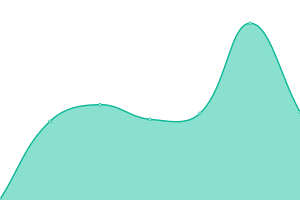
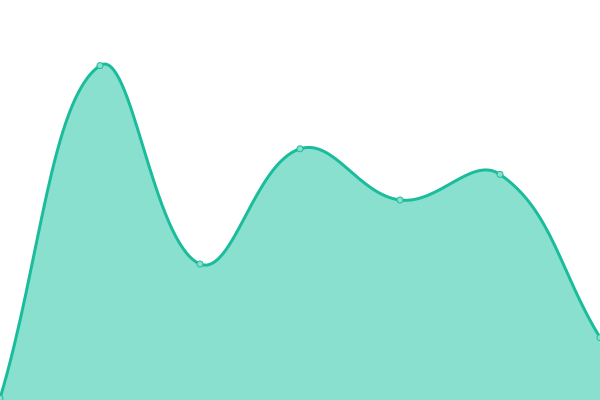

# Welcome to the Backend Status for the Scratch Website!

I was stupid to rename orgs, and the old url died. now scratchstatus has been renamed to ScratchSuite.

# [📈 Live Status](https://scratchstatus.github.io/backend): <!--live status--> **🟧 Partial outage**

<!--start: status pages-->
<!-- This summary is generated by Upptime (https://github.com/upptime/upptime) -->
<!-- Do not edit this manually, your changes will be overwritten -->
<!-- prettier-ignore -->
| URL | Status | History | Response Time | Uptime |
| --- | ------ | ------- | ------------- | ------ |
|  [Scratch - site-api](https://scratch.mit.edu/site-api) | 🟩 Up | [scratch-site-api.yml](https://github.com/scratchsuite/backend/commits/HEAD/history/scratch-site-api.yml) | 

 233ms
     
 | 

<a href="https://scratchsuite.github.io/backend/history/scratch-site-api">100.00%</a>
    

|  [Scratch - API](https://api.scratch.mit.edu) | 🟩 Up | [scratch-api.yml](https://github.com/scratchsuite/backend/commits/HEAD/history/scratch-api.yml) | 

 107ms
     
 | 

<a href="https://scratchsuite.github.io/backend/history/scratch-api">100.00%</a>
    

|  [Scratch - CDN](https://cdn.scratch.mit.edu/) | 🟩 Up | [scratch-cdn.yml](https://github.com/scratchsuite/backend/commits/HEAD/history/scratch-cdn.yml) | 

 106ms
     
 | 

<a href="https://scratchsuite.github.io/backend/history/scratch-cdn">100.00%</a>
    

|  [Scratch - CDN2](https://cdn2.scratch.mit.edu/) | 🟩 Up | [scratch-cdn-2.yml](https://github.com/scratchsuite/backend/commits/HEAD/history/scratch-cdn-2.yml) | 

 79ms
     
 | 

<a href="https://scratchsuite.github.io/backend/history/scratch-cdn-2">100.00%</a>
    

|  [Scratch - Projects](https://projects.scratch.mit.edu/) | 🟥 Down | [scratch-projects.yml](https://github.com/scratchsuite/backend/commits/HEAD/history/scratch-projects.yml) | 

 112ms
     
 | 

<a href="https://scratchsuite.github.io/backend/history/scratch-projects">100.00%</a>
    

<!--end: status pages-->

[**Visit our status website →**](https://scratchstatus.github.io/backend)

## 📄 License

- Powered by: [Upptime](https://github.com/upptime/upptime)
- Code: [MIT](./LICENSE) © [ScratchStatus](scratchstatus.github.io)
- Data in the `./history` directory: [Open Database License](https://opendatacommons.org/licenses/odbl/1-0/)
